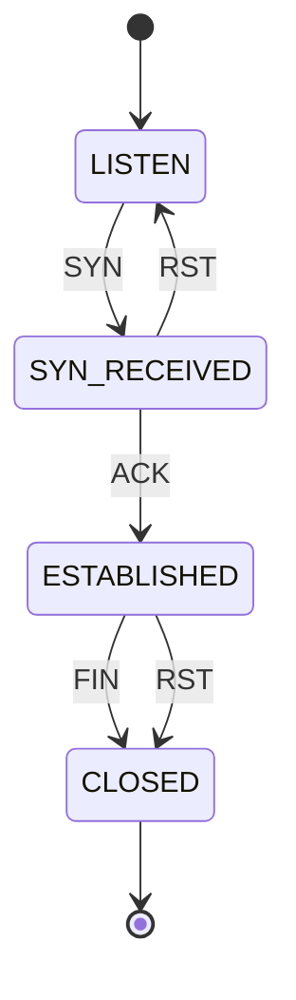

# Finite-State Machines Are Hiding Inside Your Network (Starting With the TCP Handshake)

*A discrete-structures topic that turned out to be a networking topic.*

I'm a cybersecurity student, and when I started the **CS202: Discrete Structures** course on Saylor, finite-state machines (FSMs) looked like one more unit to get through, right after sets, logic and induction. Then I realised I'd already been drawing them in my networking labs without calling them that. Every time I traced a TCP handshake in Packet Tracer, I was walking an FSM.

So this post is me connecting the two: what an FSM actually is, how the TCP handshake maps onto one, and how that gives you a neat way to think about SYN floods. There's a small Python script in this repo and I ran it for real, so the output below is not made up.

---

## What is a finite-state machine?

The course intro talks about discrete systems being in **one state at a time**, with answers being a clean yes/no, 0 or 1. An FSM is exactly that idea turned into a model. Formally, a deterministic finite automaton (DFA) is five things:

| Symbol | Meaning | In plain words |
|---|---|---|
| Q | set of states | every situation the machine can be in |
| Σ | input alphabet | the things that can happen to it |
| δ | transition function | (current state, input) → next state |
| q₀ | start state | where it begins |
| F | accepting states | where "success" or "finished" lives |

That's all of it. No memory beyond "which state am I in right now". That limitation is the whole point: it makes FSMs easy to reason about, easy to test, and easy to implement in hardware or code.

---

## Mapping it onto the TCP handshake

Here's the server side of a TCP connection, heavily simplified. I kept only four states and the inputs that move between them.


The same thing as a Mermaid diagram (GitHub renders this natively, so it stays editable):



Mapped to the five-tuple:

- **Q** = {LISTEN, SYN_RECEIVED, ESTABLISHED, CLOSED}
- **Σ** = {SYN, ACK, FIN, RST}
- **q₀** = LISTEN
- **F** = {CLOSED}, treating "closed cleanly" as the finish line
- **δ** = the arrows above

**Simplifications I made on purpose:** real TCP has more states (FIN_WAIT, TIME_WAIT, and so on), and the server's SYN-ACK reply is an *output*, not an input, so it doesn't appear as an arrow. If you want the full picture, RFC 793 has the complete state diagram. I just wanted the part that makes the idea click.

---

## The code

The whole machine is a dictionary. `δ` is literally a lookup table:

```python
DELTA = {
    ("LISTEN", "SYN"): "SYN_RECEIVED",
    ("SYN_RECEIVED", "ACK"): "ESTABLISHED",
    ("SYN_RECEIVED", "RST"): "LISTEN",
    ("ESTABLISHED", "FIN"): "CLOSED",
    ("ESTABLISHED", "RST"): "CLOSED",
}
```

If a (state, input) pair isn't in the table, the packet is rejected. Full script: [`tcp_fsm.py`](tcp_fsm.py). Run it with `python3 tcp_fsm.py`.

### Real output

```text
normal handshake + close
  LISTEN        --SYN--> SYN_RECEIVED
  SYN_RECEIVED  --ACK--> ESTABLISHED
  ESTABLISHED   --FIN--> CLOSED
  -> final state: CLOSED, accepted: True

ACK with no SYN first
  LISTEN        --ACK--> REJECT (no such transition)
  -> final state: LISTEN, accepted: False

duplicate SYN mid-handshake
  LISTEN        --SYN--> SYN_RECEIVED
  SYN_RECEIVED  --SYN--> REJECT (no such transition)
  -> final state: SYN_RECEIVED, accepted: False

reset during handshake
  LISTEN        --SYN--> SYN_RECEIVED
  SYN_RECEIVED  --RST--> LISTEN
  -> final state: LISTEN, accepted: True

half-open tracking across sources
  sources tracked: 8, half-open: 6, established: 2
  half-open > 5? ALERT
```

The second case is my favourite. An `ACK` out of nowhere has no arrow from LISTEN, so the machine just refuses it. That's the core idea behind **stateful firewalls**: they keep track of which state each connection is in, and packets that don't fit the expected transitions get dropped.

---

## Where the security angle comes in

### 1. SYN floods are an FSM problem

Look at the SYN_RECEIVED state. The server gets there after a SYN and then *waits* for the ACK. It has to hold resources for that half-open connection while it waits.

A SYN flood abuses this: send loads of SYNs (often from spoofed addresses), never send the ACK, and the server fills up with connections parked in SYN_RECEIVED.

Notice what that means in FSM terms. It's not one machine behaving strangely. It's **many machines all stuck in the same state**. That's why the last block of my demo doesn't test a single sequence, it tracks one state per source and counts how many are sitting in SYN_RECEIVED. Past a threshold, it alerts.

(My threshold of 5 is arbitrary and just for the demo. Real systems tune this against normal traffic, and defences like SYN cookies avoid holding that state in the first place.)

### 2. Stateful firewalls and IDS

Same trick, bigger scale. Track the state per connection, define which transitions are legal, and flag anything else.

### 3. Protocol parsing

Parsers for network protocols are often written as state machines too. The security flip side: if the parser's state machine has a gap or an unexpected transition, that's a place where malformed input can cause trouble. Knowing the model helps you spot where to look.

### 4. Regular expressions

Regexes and DFAs describe the same class of languages (regular languages). If you've written a regex to match patterns in logs, you've been using this idea already.

---

## Video resources

Clicking the thumbnail opens the video on YouTube (GitHub READMEs can't embed a player, so a linked thumbnail is the standard trick):

[](https://www.youtube.com/watch?v=Qa6csfkK7_I)

<!-- TODO before posting: watch this once and confirm it's the explanation you want to link. Swap the ID in both URLs if you prefer another video. -->

---

## What I took away

1. FSMs are boring on paper and surprisingly useful in practice. A tiny table of transitions can model a whole protocol.
2. Thinking in states makes attacks easier to describe. "The server is stuck in SYN_RECEIVED" is a clearer sentence than "the server is overloaded."
3. The model has limits. An FSM only remembers its current state, so it can't count arbitrarily (my half-open counter is *outside* the machine, in a dictionary). Things that need real memory need stronger models, which is a story for later units.

## Try it yourself

```bash
git clone <your-repo-url>
cd fsm-tcp-handshake
python3 tcp_fsm.py
```

Ideas to extend it:

- Add the missing TCP states (FIN_WAIT, TIME_WAIT) and compare against RFC 793.
- Feed it a packet capture exported from Wireshark or Packet Tracer instead of hand-written lists.
- Add a timeout so half-open connections expire, then see how that changes the alert.

## References

- Saylor University, *CS202: Discrete Structures* (course introduction and unit outline): https://learn.saylor.org/course/cs202
- RFC 793, *Transmission Control Protocol*: https://www.rfc-editor.org/rfc/rfc793

